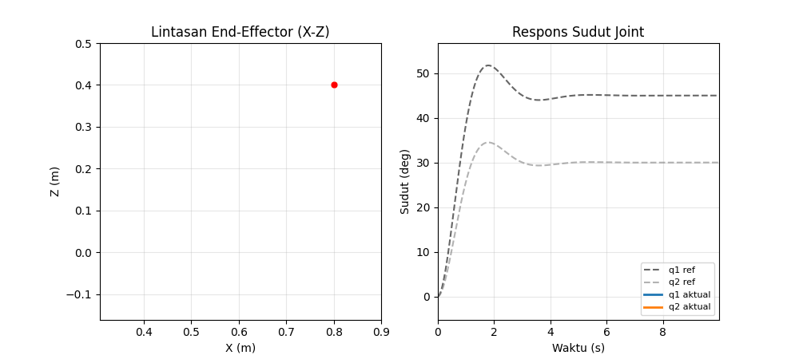
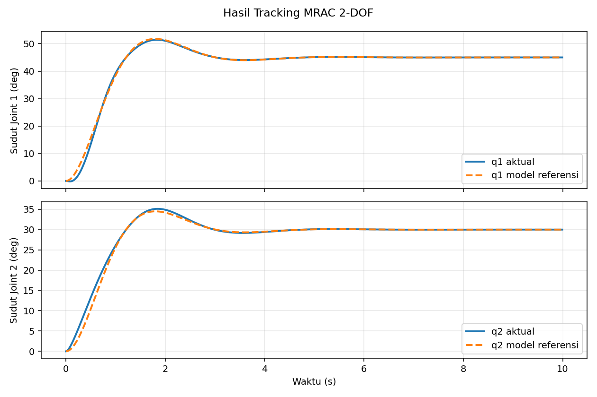
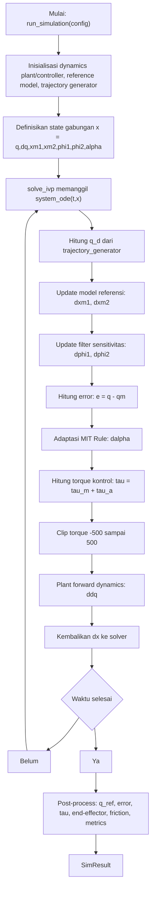
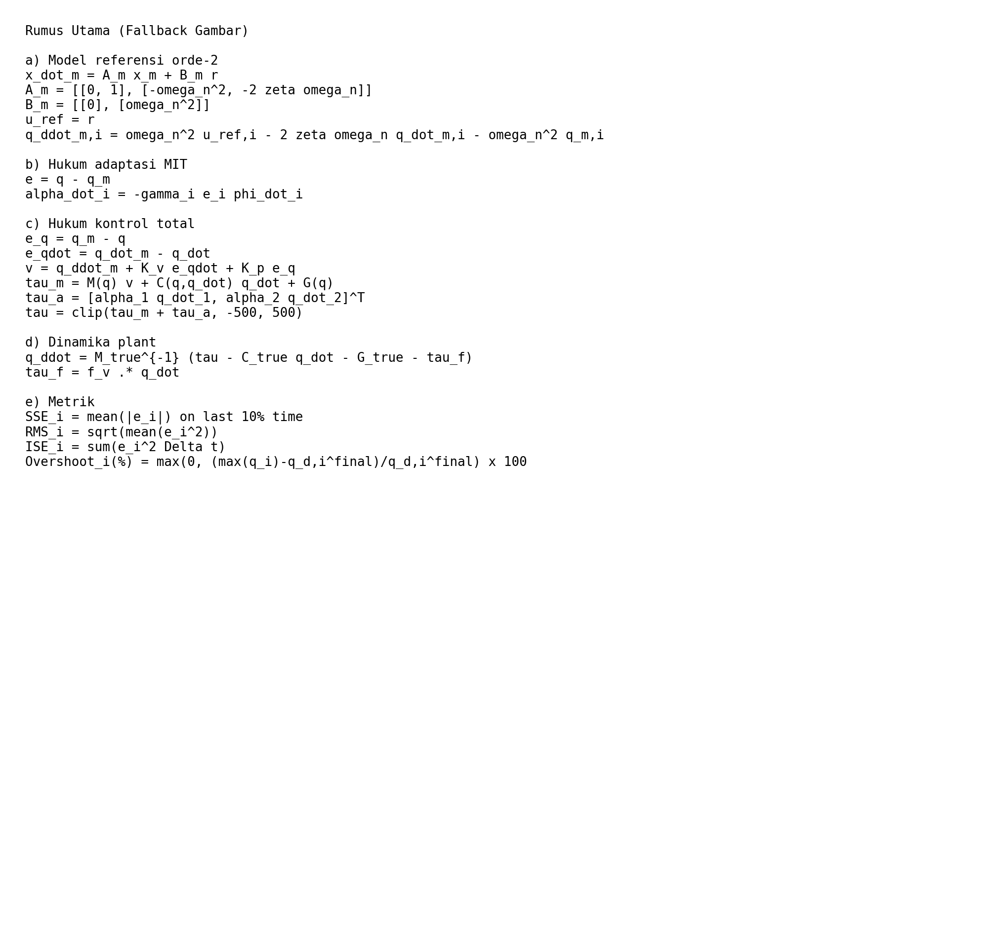

# MRAC Simulation for 2-DOF Parabolic Antenna

Simulasi ini memodelkan antena parabola 2-DOF (azimuth–elevation) sebagai sistem robotik 2-joint dan mengendalikan geraknya dengan kombinasi **Computed Torque + MRAC (MIT Rule)**.

## Preview



## Hasil Simulasi



Ringkasan metrik (konfigurasi default):

- Steady-state error joint 1: **0.000002 rad**
- Steady-state error joint 2: **0.000004 rad**
- Overshoot joint 1: **14.30%**
- Overshoot joint 2: **17.08%**
- Settling time joint 1: **3.78 s**
- Settling time joint 2: **3.99 s**
- Max torque joint 1: **176.84 Nm**
- Max torque joint 2: **80.45 Nm**

---

## 1) Sistem yang Dimodelkan

### Antena sebagai manipulator serial 2-DOF
- **Joint 1 (q1)**: azimuth (rotasi horizontal)
- **Joint 2 (q2)**: elevation/slope (rotasi vertikal)

### Kinematika (DH)
Transformasi Denavit–Hartenberg digunakan untuk menghitung pose antar-link hingga titik ujung (arah pointing antena) dalam ruang 3D.

### Dinamika (Euler–Lagrange)
Persamaan gerak plant mempertimbangkan:
- matriks inersia \(M(q)\),
- efek Coriolis/sentrifugal \(C(q,\dot{q})\dot{q}\),
- gravitasi \(G(q)\),
- torsi disipatif/friksi viskos.

Bentuk umum model:
\[
M(q)\ddot{q} + C(q,\dot{q})\dot{q} + G(q) + F_v\dot{q} = \tau
\]

---

## 2) Fitur Utama Implementasi

### Engine Simulasi
- Integrasi ODE penuh dengan `scipy.integrate.solve_ivp` (default `RK45`).
- Simulasi tunggal dan batch (`run_simulation`, `run_batch`).
- Pembatasan torsi aktuator (torque clipping) untuk menjaga realistis numerik.

### Strategi Kontrol
- **Computed Torque** untuk kompensasi nonlinier plant.
- **MRAC berbasis MIT Rule** untuk update parameter adaptif online.
- Tracking terhadap **model referensi orde-2** (bukan hanya setpoint statis).

### Jenis Lintasan Input
- `step`
- `sinusoidal`
- `multipoint` (interpolasi spline)

### Analitik dan Metrik
- SSE, peak error, overshoot, settling time 2%, RMS, ISE, max torque.
- Logging sinyal penting: \(q\), \(\dot q\), \(q_m\), error, \(\tau\), parameter adaptif, end-effector, torsi friksi.

### GUI interaktif (PySide6)
- Blok diagram ala Simulink.
- Panel parameter untuk plant, referensi, kontroler, dan simulasi.
- 6 tab output:
  1. Basic System Output
  2. MRAC Performance Analysis
  3. Adaptive Parameters
  4. Optimization: Gain Variation
  5. Metrics
  6. 3D Dynamics
- Visualisasi 3D gerak antena.
- Export hasil ke PNG, CSV, dan TXT metrik.

---

## 3) Kelebihan Sistem

- **Model fisik lengkap**: kinematika + dinamika nonlinier + friksi.
- **Tracking berbasis model referensi**: performa transien lebih terarah (sesuai spesifikasi desain).
- **Tahan mismatch model**: adaptasi online membantu saat parameter plant tidak ideal.
- **Eksperimen cepat**: parameter bisa diubah langsung dari GUI.
- **Analisis komprehensif**: kurva, metrik numerik, sweep gain, dan visualisasi 3D tersedia dalam satu alur.

---

## 4) Kenapa Sistem Ini Adaptif?

Sistem ini adaptif karena parameter kontrol **tidak tetap**, tetapi diperbarui selama simulasi berdasarkan error tracking:

- Error utama: \(e = q - q_m\)
- Parameter adaptif \(\alpha\) diperbarui kontinu via MIT Rule.
- Laju adaptasi diatur gain \(\gamma\):
  - \(\gamma\) terlalu besar → respons cepat tapi berpotensi osilatif.
  - \(\gamma\) terlalu kecil → stabil tapi adaptasi lambat.

Dengan mekanisme ini, kontroler bisa menyesuaikan aksi kontrol saat terjadi ketidakpastian (misalnya perubahan friksi/parameter efektif plant), sehingga tracking ke model referensi tetap terjaga.

---

## 5) Bagaimana Prosesnya (Alur Kerja End-to-End)

1. **Tentukan konfigurasi simulasi**  
   Input trajectory, parameter fisik plant, gain PD, gain adaptif \(\gamma\), dan parameter model referensi (\(\zeta, \omega_n\)).

2. **Bangun sinyal referensi**  
   Generator trajectory membuat \(q_d, \dot q_d, \ddot q_d\) sesuai mode input (step/sinusoidal/multipoint).

3. **Jalankan model referensi**  
   Dinamika referensi orde-2 menghasilkan lintasan target internal \(q_m, \dot q_m\).

4. **Hitung error tracking**  
   Error antara plant dan model referensi digunakan sebagai sinyal adaptasi dan koreksi kontrol.

5. **Update parameter adaptif (MIT Rule)**  
   \(\dot{\alpha}\) dihitung online dari error dan sinyal sensitivitas/filter.

6. **Hitung torsi kontrol total**  
   Torsi = computed torque (kompensasi nonlinier + PD tracking) + komponen adaptif.

7. **Integrasi dinamika plant**  
   ODE solver memperbarui state \(q, \dot q\) sepanjang horizon waktu.

8. **Post-processing hasil**  
   Sistem menghitung metrik performa, menampilkan plot/tab analisis, animasi 3D, dan opsional export data.

---

## 6) Konteks Toolchain Pengembangan

Alur akademik/referensi metode:
1. **Modeling (CATIA V5)**: ekstraksi parameter fisik \((m, I, a, d)\).
2. **Mathematics (Maple 13)**: penurunan simbolik model dinamik.
3. **Simulation (MATLAB/Simulink)**: verifikasi hukum kontrol.

Repository ini menyediakan implementasi numerik ekuivalen berbasis **Python (NumPy/SciPy + GUI PySide6)** untuk eksperimen MRAC 2-DOF.

---

## 7) Flowchart Proses Simulasi (Sesuai Kode)



---

## 8) Logika Sistem per Tahap

1. **Trajectory layer**  
   `trajectory_generator()` menghasilkan \(q_d,\dot q_d,\ddot q_d\) berdasarkan mode `step/sinusoidal/multipoint`.

2. **Reference model layer**  
   Untuk tiap joint, `ReferenceModel.state_derivative()` memperbarui state \(x_m=[q_m,\dot q_m]\) dari input \(r=q_d\).

3. **Adaptive sensitivity layer**  
   State filter \(\phi\) diperbarui dari input \(q_i/\omega_n^2\), lalu sensitivitas yang dipakai adaptasi adalah \(\dot\phi_i\) (`phi_i[1]`).

4. **Error and adaptation layer**  
   Error utama: \(e=q-q_m\).  
   Parameter adaptif \(\alpha\) diperbarui online dengan MIT Rule.

5. **Control synthesis layer**  
   Kontrol total = computed torque nominal (\(\tau_m\)) + kompensasi adaptif friksi (\(\tau_a\)).

6. **Plant propagation layer**  
   Plant dihitung dengan `forward_dynamics()` memakai model plant (termasuk friksi), menghasilkan \(\ddot q\), lalu solver mengintegrasikan state.

7. **Monitoring layer**  
   Setelah integrasi selesai, sistem menghitung metrik performa (SSE, overshoot, settling time, RMS, ISE, max torque, peak error).

---

## 9) Algoritma Inti (Pseudo-algoritmik dari `run_simulation`)

1. Inisialisasi objek `Dynamics2DoF`, `ReferenceModel`, `MRACController`, trajectory function, dan FK.  
2. Bentuk state awal nol: \(x_0=[q,dq,xm1,xm2,\phi1,\phi2,\alpha]\).  
3. Jalankan `solve_ivp(system_ode, ...)`.  
4. Pada setiap evaluasi `system_ode(t,x)`:
   - unpack \(x\),
   - set `controller.alpha = alpha`,
   - hitung \(q_d\), set \(r=q_d\),
   - hitung \(dxm_1, dxm_2\),
   - hitung \(d\phi_1, d\phi_2\),
   - hitung \(q_m,\dot q_m,e\),
   - hitung \(d\alpha\) via `adaptation_law(e, dphi_val)`,
   - hitung \(\tau\) via `compute_full_torque(...)`,
   - clip \(\tau\) ke \([-500,500]\),
   - hitung \(\ddot q\) via `plant_dynamics.forward_dynamics(...)`,
   - pack turunan state dan kembalikan ke solver.
5. Setelah solver selesai, bentuk semua sinyal output (`q`, `dq`, `q_ref`, `error`, `tau`, `alpha_adapt`, `end_effector`, `friction_torque`).
6. Hitung metrik dengan `compute_metrics(...)`.
7. Kembalikan `SimResult`.

---

## 10) Rumus Utama (Dipakai di Implementasi Kode)

Jika tampilan rumus LaTeX tidak ter-render di GitHub rich display, gunakan fallback gambar berikut:



### a) Model referensi orde-2 (`models/reference_model.py`)
\[
\dot{x}_m = A_m x_m + B_m r,\quad
A_m=\begin{bmatrix}0&1\\-\omega_n^2&-2\zeta\omega_n\end{bmatrix},\;
B_m=\begin{bmatrix}0\\\omega_n^2\end{bmatrix}
\]

Komponen percepatan referensi yang dipakai kontrol (`compute_full_torque`):
\[
u_{ref} \equiv r
\]
\[
\ddot q_{m,i}=\omega_n^2\,u_{ref,i}-2\zeta\omega_n\,\dot q_{m,i}-\omega_n^2\,q_{m,i}
\]

### b) Hukum adaptasi MIT (`control/controller.py`)
Dengan \(e=q-q_m\):
\[
\dot\alpha_i=-\gamma_i\,e_i\,\dot\phi_i
\]

### c) Hukum kontrol total (`control/controller.py`)
Error kontrol terhadap model referensi:
\[
e_q=q_m-q,\qquad e_{\dot q}=\dot q_m-\dot q
\]

Sinyal bantu:
\[
v=\ddot q_m+K_v e_{\dot q}+K_p e_q
\]

Komponen torsi:
\[
\tau_m=M(q)\,v+C(q,\dot q)\dot q+G(q),\qquad
\tau_a=\begin{bmatrix}\alpha_1\dot q_1\\\alpha_2\dot q_2\end{bmatrix}
\]

Torsi total:
\[
\tau=\tau_m+\tau_a,\quad \tau\leftarrow\mathrm{clip}(\tau,-500,500)
\]

### d) Dinamika plant (`models/dynamics.py`)
\[
\ddot q = M_{true}^{-1}\left(\tau - C_{true}\dot q - G_{true} - \tau_f\right),\qquad
\tau_f = f_v \odot \dot q
\]

### e) Rumus metrik (`simulation/simulator.py`)
\[
\text{SSE}_i=\text{mean}\left(|e_i|\right)_{\text{10\% waktu terakhir}},\quad
\text{RMS}_i=\sqrt{\text{mean}(e_i^2)},\quad
\text{ISE}_i=\sum e_i^2\,\Delta t
\]
\[
\text{Overshoot}_i(\%)=\max\left(0,\frac{\max(q_i)-q_{d,i}^{final}}{q_{d,i}^{final}}\right)\times 100
\]

---

## Menjalankan Proyek

```bash
pip install -r requirements.txt
python test_all.py
python run.py
```

- `test_all.py` menguji modul model, kontroler, simulasi, dan import GUI.
- `run.py` menjalankan GUI simulasi utama.
