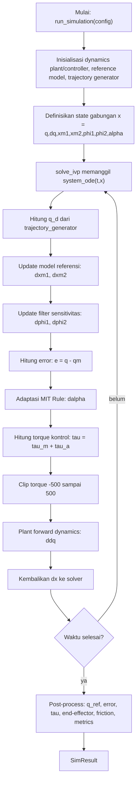

# MRAC Simulation for 2-DOF Parabolic Antenna

Simulasi ini memodelkan antena parabola 2-DOF (azimuth–elevation) sebagai sistem robotik 2-joint dan mengendalikan geraknya dengan kombinasi **Computed Torque + MRAC (MIT Rule)**.

## Preview


## Hasil Simulasi


Ringkasan metrik (konfigurasi default):

- Steady-state error joint 1: **0.000002 rad**
- Steady-state error joint 2: **0.000004 rad**
- Overshoot joint 1: **14.30%**
- Overshoot joint 2: **17.08%**
- Settling time joint 1: **3.78 s**
- Settling time joint 2: **3.99 s**
- Max torque joint 1: **176.84 Nm**
- Max torque joint 2: **80.45 Nm**

---

## 1) Sistem yang Dimodelkan

### Antena sebagai manipulator serial 2-DOF
- **Joint 1 (q1)**: azimuth (rotasi horizontal)
- **Joint 2 (q2)**: elevation/slope (rotasi vertikal)

### Kinematika (DH)
Transformasi Denavit–Hartenberg digunakan untuk menghitung pose antar-link hingga titik ujung (arah pointing antena) dalam ruang 3D.

### Dinamika (Euler–Lagrange)
Persamaan gerak plant mempertimbangkan:
- matriks inersia ,
- efek Coriolis/sentrifugal ,
- gravitasi ,
- torsi disipatif/friksi viskos.

Bentuk umum model:

<p align="center"></p>


---

## 2) Fitur Utama Implementasi

### Engine Simulasi
- Integrasi ODE penuh dengan `scipy.integrate.solve_ivp` (default `RK45`).
- Simulasi tunggal dan batch (`run_simulation`, `run_batch`).
- Pembatasan torsi aktuator (torque clipping) untuk menjaga realistis numerik.

### Strategi Kontrol
- **Computed Torque** untuk kompensasi nonlinier plant.
- **MRAC berbasis MIT Rule** untuk update parameter adaptif online.
- Tracking terhadap **model referensi orde-2** (bukan hanya setpoint statis).

### Jenis Lintasan Input
- `step`
- `sinusoidal`
- `multipoint` (interpolasi spline)

### Analitik dan Metrik
- SSE, peak error, overshoot, settling time 2%, RMS, ISE, max torque.
- Logging sinyal penting: , , , error, , parameter adaptif, end-effector, torsi friksi.

### GUI interaktif (PySide6)
- Blok diagram ala Simulink.
- Panel parameter untuk plant, referensi, kontroler, dan simulasi.
- 6 tab output:
  1. Basic System Output
  2. MRAC Performance Analysis
  3. Adaptive Parameters
  4. Optimization: Gain Variation
  5. Metrics
  6. 3D Dynamics
- Visualisasi 3D gerak antena.
- Export hasil ke PNG, CSV, dan TXT metrik.

---

## 3) Kelebihan Sistem

- **Model fisik lengkap**: kinematika + dinamika nonlinier + friksi.
- **Tracking berbasis model referensi**: performa transien lebih terarah (sesuai spesifikasi desain).
- **Tahan mismatch model**: adaptasi online membantu saat parameter plant tidak ideal.
- **Eksperimen cepat**: parameter bisa diubah langsung dari GUI.
- **Analisis komprehensif**: kurva, metrik numerik, sweep gain, dan visualisasi 3D tersedia dalam satu alur.

---

## 4) Kenapa Sistem Ini Adaptif?

Sistem ini adaptif karena parameter kontrol **tidak tetap**, tetapi diperbarui selama simulasi berdasarkan error tracking:

- Error utama: 
- Parameter adaptif  diperbarui kontinu via MIT Rule.
- Laju adaptasi diatur gain :
  -  terlalu besar → respons cepat tapi berpotensi osilatif.
  -  terlalu kecil → stabil tapi adaptasi lambat.

Dengan mekanisme ini, kontroler bisa menyesuaikan aksi kontrol saat terjadi ketidakpastian (misalnya perubahan friksi/parameter efektif plant), sehingga tracking ke model referensi tetap terjaga.

---

## 5) Bagaimana Prosesnya (Alur Kerja End-to-End)

1. **Tentukan konfigurasi simulasi**  
   Input trajectory, parameter fisik plant, gain PD, gain adaptif , dan parameter model referensi ().

2. **Bangun sinyal referensi**  
   Generator trajectory membuat  sesuai mode input (step/sinusoidal/multipoint).

3. **Jalankan model referensi**  
   Dinamika referensi orde-2 menghasilkan lintasan target internal .

4. **Hitung error tracking**  
   Error antara plant dan model referensi digunakan sebagai sinyal adaptasi dan koreksi kontrol.

5. **Update parameter adaptif (MIT Rule)**  
    dihitung online dari error dan sinyal sensitivitas/filter.

6. **Hitung torsi kontrol total**  
   Torsi = computed torque (kompensasi nonlinier + PD tracking) + komponen adaptif.

7. **Integrasi dinamika plant**  
   ODE solver memperbarui state  sepanjang horizon waktu.

8. **Post-processing hasil**  
   Sistem menghitung metrik performa, menampilkan plot/tab analisis, animasi 3D, dan opsional export data.

---

## 6) Konteks Toolchain Pengembangan

Alur akademik/referensi metode:
1. **Modeling (CATIA V5)**: ekstraksi parameter fisik .
2. **Mathematics (Maple 13)**: penurunan simbolik model dinamik.
3. **Simulation (MATLAB/Simulink)**: verifikasi hukum kontrol.

Repository ini menyediakan implementasi numerik ekuivalen berbasis **Python (NumPy/SciPy + GUI PySide6)** untuk eksperimen MRAC 2-DOF.

---

## 7) Flowchart Proses Simulasi (Sesuai Kode)



---

## 8) Logika Sistem per Tahap

1. **Trajectory layer**  
   `trajectory_generator()` menghasilkan  berdasarkan mode `step/sinusoidal/multipoint`.

2. **Reference model layer**  
   Untuk tiap joint, `ReferenceModel.state_derivative()` memperbarui state  dari input .

3. **Adaptive sensitivity layer**  
   State filter  diperbarui dari input , lalu sensitivitas yang dipakai adaptasi adalah  (`phi_i[1]`).

4. **Error and adaptation layer**  
   Error utama: .  
   Parameter adaptif  diperbarui online dengan MIT Rule.

5. **Control synthesis layer**  
   Kontrol total = computed torque nominal () + kompensasi adaptif friksi ().

6. **Plant propagation layer**  
   Plant dihitung dengan `forward_dynamics()` memakai model plant (termasuk friksi), menghasilkan , lalu solver mengintegrasikan state.

7. **Monitoring layer**  
   Setelah integrasi selesai, sistem menghitung metrik performa (SSE, overshoot, settling time, RMS, ISE, max torque, peak error).

---

## 9) Algoritma Inti (Pseudo-algoritmik dari `run_simulation`)

1. Inisialisasi objek `Dynamics2DoF`, `ReferenceModel`, `MRACController`, trajectory function, dan FK.  
2. Bentuk state awal nol: .  
3. Jalankan `solve_ivp(system_ode, ...)`.  
4. Pada setiap evaluasi `system_ode(t,x)`:
   - unpack ,
   - set `controller.alpha = alpha`,
   - hitung , set ,
   - hitung ,
   - hitung ,
   - hitung ,
   - hitung  via `adaptation_law(e, dphi_val)`,
   - hitung  via `compute_full_torque(...)`,
   - clip  ke ,
   - hitung  via `plant_dynamics.forward_dynamics(...)`,
   - pack turunan state dan kembalikan ke solver.
5. Setelah solver selesai, bentuk semua sinyal output (, , , , , , , ).
6. Hitung metrik dengan `compute_metrics(...)`.
7. Kembalikan `SimResult`.

---

## 10) Rumus Utama (Dipakai di Implementasi Kode)

### a) Model referensi orde-2 (`models/reference_model.py`)

<p align="center"></p>


Komponen percepatan referensi yang dipakai kontrol (`compute_full_torque`):

<p align="center"></p>


<p align="center"></p>


### b) Hukum adaptasi MIT (`control/controller.py`)
Dengan :

<p align="center"></p>


### c) Hukum kontrol total (`control/controller.py`)
Error kontrol terhadap model referensi:

<p align="center"></p>


Sinyal bantu:

<p align="center"></p>


Komponen torsi:

<p align="center"></p>


Torsi total:

<p align="center"></p>


### d) Dinamika plant (`models/dynamics.py`)

<p align="center"></p>


### e) Rumus metrik (`simulation/simulator.py`)

<p align="center"></p>


<p align="center"></p>


---

## 11) Input Sinyal: Step vs. Sinusoidal & Multi-Point

### Apa yang Ada di Jurnal Referensi (Soares et al., 2021)?

Jurnal referensi **Soares et al. (2021)** secara eksplisit menyebutkan:

> *"In the simulations step functions were used as inputs of the system. Each entry represents the desired angular displacement..."*

Artinya, jurnal tersebut **hanya menggunakan Step Input** — yaitu perintah posisi mendadak ke 60° dan 30° — untuk memvalidasi bahwa kontroler MRAC berhasil.

### Mengapa Sinusoidal & Multi-Point Ditambahkan ke Proyek Ini?

Kedua jenis sinyal berikut **tidak ada di jurnal referensi**, melainkan ditambahkan sebagai **novelty/pengembangan** proyek ini:

| Jenis Input | Ada di Jurnal? | Tujuan |
|---|---|---|
| `step` | ✅ Ya | Validasi / verifikasi terhadap jurnal |
| `sinusoidal` | ❌ Tidak | Uji robustness pada pelacakan lintasan dinamis berkelanjutan |
| `multipoint` | ❌ Tidak | Uji robustness pada perubahan waypoint (mendekati kondisi dunia nyata) |

### Alasan Penambahan:

1. **Pembuktian Lebih Keras (Robustness Test)**  
   Membuktikan kemampuan MRAC hanya dengan Step Input dianggap standar/biasa untuk skripsi/tesis teknik kendali. Dengan Sinusoidal dan Multi-Point, MRAC diuji terhadap referensi yang selalu berubah — jauh lebih menantang.

2. **Kondisi Dunia Nyata**  
   Pesawat, satelit, atau antena bergerak yang bergeser tidak pernah bergerak secara "Step". Mereka bergerak secara kontinu (sinusoidal) atau mengikuti rute titik-demi-titik (waypoints/multipoint).

3. **Meningkatkan Bobot Riset**  
   Dengan adanya dua sinyal ini, laporan dapat berargumen:  
   > *"Riset ini tidak sekadar meniru jurnal acuan (Soares et al.) yang hanya mengandalkan Step Input, melainkan mengembangkannya dengan menguji ketangguhan MRAC pada pelacakan lintasan dinamis berkelanjutan (Sinusoidal & Waypoints)."*

### Kesimpulan:
- **Step** → fitur **wajib** untuk validasi/verifikasi hasil dengan jurnal referensi.
- **Sinusoidal & Multi-Point** → fitur **pengembangan** untuk eksplorasi keunggulan MRAC yang dibangun.

---

## Menjalankan Proyek

```bash
pip install -r requirements.txt
python test_all.py
python run.py
```

- `test_all.py` menguji modul model, kontroler, simulasi, dan import GUI.
- `run.py` menjalankan GUI simulasi utama.
